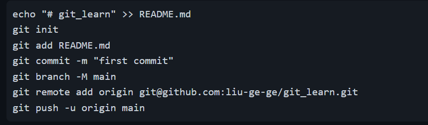

<h1 align="center">git learn</h1>

## Git 是什么
**Git** 是一个分布式的代码托管工具，可以基于同一套代码，在不同的项目上进行开发，最终都可以把代码同步到Git服务器上

## 集中式 vs 分布式

> **集中式**：版本库是放在中央服务器的，工作的时候要先从中央服务器读取到最新的版本，工作完之后，再把自己的修改推送给中央服务器，最大的问题还是必须要联网才能工作。

> **分布式** : 分布式是没有中央服务器的，每个人的电脑上都是一个完整的版本库，这样工作时就不需要联网了，如何多人协作？ 比如你在自己的电脑上修改文件A，同事也修改了文件A，然后把各自的修改推送给对方，就可以看到对方的修改了。


## Git 关键的几个概念

- Working Directory (工作区)
  > 我们编辑与改动的代码文件，都在工作区下面 
- Stating Area （缓存区）
  > 代码有变动的时候，我们可以把每次变动后的代码，提交到Git缓存区，让Git记录代码的变动
- Respository (仓库)
  > 在Git缓存区的代码，都可以提交到Git仓库进行托管

## 常用命令

```shell
git config --list 查看配置信息
git config --global user.name 查看全局的username
git config --global user.email 邮箱配置
git --help 查看git的所有命令

==================本地仓库的初始化==================
1. git clone ... 将github上的存储库clone到一个新目录
2. git init      创建一个空的Git存储库或重新初始化一个现有的Git存储库

=============将工作区文件添加到git缓存区=============
1. git status 查看本地文件的修改和添加
2. git add . / 文件名称  将本地修改/添加的所有文件添加到缓存区

==============将缓存区文件提交到版本库中=============
git commit -m "提交信息"

=======================提交记录=====================
git log


```
这个是在github 创建好仓库后需要连接到远程仓库


## git init 初始化本地仓库
```shell
git init     #( 初始化本地仓库 )
git add .    #( 提交所有修改 到缓存区 )
git commit -m "修改" #（ 提交到本地仓库 ）
git remote add origin ... # （ 添加远程仓库镜像 ）
git push -u origin main  #（ 就是把本地仓库提交到远程仓库的main分支下 ）
```

