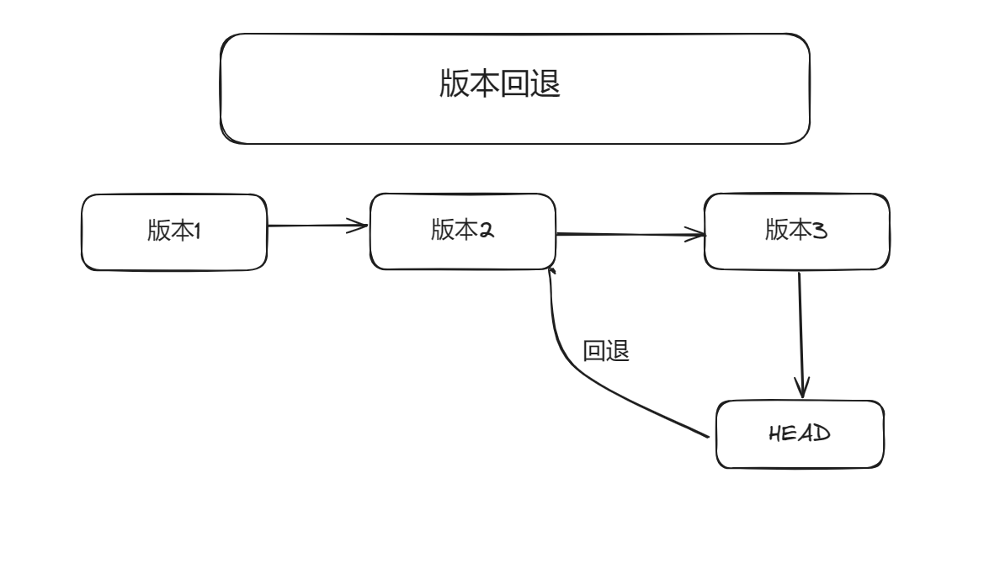

<h1 align="center">git learn</h1>

## Git 是什么
**Git** 是一个分布式的代码托管工具，可以基于同一套代码，在不同的项目上进行开发，最终都可以把代码同步到Git服务器上

## 集中式 vs 分布式

> **集中式**：版本库是放在中央服务器的，工作的时候要先从中央服务器读取到最新的版本，工作完之后，再把自己的修改推送给中央服务器，最大的问题还是必须要联网才能工作。

> **分布式** : 分布式是没有中央服务器的，每个人的电脑上都是一个完整的版本库，这样工作时就不需要联网了，如何多人协作？ 比如你在自己的电脑上修改文件A，同事也修改了文件A，然后把各自的修改推送给对方，就可以看到对方的修改了。


## Git 关键的几个概念

- Working Directory (工作区)
  > 我们编辑与改动的代码文件，都在工作区下面 
- Stating Area （缓存区）
  > 代码有变动的时候，我们可以把每次变动后的代码，提交到Git缓存区，让Git记录代码的变动
- Respository (仓库)
  > 在Git缓存区的代码，都可以提交到Git仓库进行托管


## 常用命令

```shell
git config --list  #查看配置信息
git config --global user.name  #查看全局的username
git config --global user.email  #邮箱配置
git --help  #查看git的所有命令

==================本地仓库的初始化==================
1. git clone ... #将github上的存储库clone到一个新目录
2. git init      #创建一个空的Git存储库或重新初始化一个现有的Git存储库

=============将工作区文件添加到git缓存区=============

1. git status #查看本地文件的修改和添加
2. git add . / 文件名称  #将本地修改/添加的所有文件添加到缓存区

==============将缓存区文件提交到版本库中=============
git commit -m "提交信息"

=======================提交记录=====================
git log  #查看提交记录

=====================查看版本差异===================
git diff 版本id 1   版本id 2

=====================提交到远程仓库===================
git push -u origin 分支名称 #第一次用一次就行以后直接 (git push)

```

## git init 初始化本地仓库
```shell
git init     #( 初始化本地仓库 )
git add .    #( 提交所有修改 到缓存区 )
git commit -m "修改" #（ 提交到本地仓库 ）
git remote add origin ... # （ 添加远程仓库镜像 ）
git push -u origin main  #（ 就是把本地仓库提交到远程仓库的main分支下 ）
```

## 分支

**Git** 通过保存一系列不同时刻的文件快照，来记录文件在不同时刻的差异。git的分支本质上是指向提交对象的可变指针。git的默认分支是master。

**Git**demaster分支并不是一个特殊分支，跟其它分支完全没有区别，之所以几乎每一个仓库都有master分支，是因为git init 命令默认创建它

不同的开发团队的分支管理规范不一样，但基本上原理是相同的。


**Master** : 这里master主分支，master分支记录重大版本更新

**Develop** : 这里值develp开发分支,从master分支创建,变动比较大，通常待上线的功能合并到这个分支

**Feature** ： 这里指feature功能分支，从develop分支创建，在这类分支上去开发新的功能，开发功能的时候，这个功能属于哪个目标发型版本还不知道，功能如果一直在开发，对应的这个功能分支就可以一直存在，待上线的时候合并到develop分支上，进行功能测试。如果不想要开发这个功能了，可以直接扔掉它。


``` shell
====================查看分支================
git branch #(查看仓库分支)
====================创建分支================
git branch xxx #(创建xxx分支)
====================切换分支================
git checkout xxx #{切换到xxx分支}
git checkout -b xxx #(创建并切换xxx分支)
=============将本地分支推送到远程仓库=========
git push -u origin xxx #(将xxx分支推送到远程)
=============将远程分支同步到本地仓库=========
git fetch #(从远程获取最新版本信息到本地)
git merge fetch_head #(将远端版本合并到当前分支)
git pull <远程主机> <远程分支>:<本地分支名> #可以用这一个命令代替上面两个命令
# 然后再进行 git checkout 远程分支 就将远程分支和本地的分支绑定起来了
```


## 假设项目分支
- **master** 线上稳定代码
- **develop** 开发中，经常会变化的测试环境分支
- **feature** 特定功能开发的分支,开发好的分支会合并到develop分支


## 分支合并

当你在feature的某一个分支里面把功能写完了，但是develop 里面还没有这个时候就需要你在develop分支将feature修改的分支提交后进行合并。

```shell
=============分支合并==============
git merge xxx #先去到你想要合并的分支比如develop ,然后合并feature xxx就是 feature
```

## 删除分支

```shell
git branch -d xxx #(删除本地xxx分支)
git push -u origin -d xxx #(删除远程xxx分支)
```


## git 版本库的代码回退



**git revert** 指令会撤回某次提交，这个指令出发的代码回退并不会真正的删除掉代码提交历史，而是将撤回操作作为一次**新的提交**


例子:假如我们现在开发到第三个版本，第二个版本不想要了，这个时候撤回，会在生成一个新版本第四版本，这个版本不包括第二个版本，但是包括第三个版本和第一个版本

- revert

```shell
git revert HEAD #(撤回现在这个版本)
git revert HEAD^ #(撤回上一个这个版本)
git revert HEAD^^ #(撤回上上一个这个版本)

git revert 版本ID #{ 撤回到指定版本 }
```
这个的作用就是将指定版本的修改删除然后重新建立一个版本,但那个版本依旧在版本库。


- reset

```shell
git reset [--soft | --mined | --hard] [HEAD]

git reset HEAD  # 重置当前版本，即撤回git add 操作
git reset HEAD^ # 重置所有内容到上一个版本
git reset HEAD^ # 重置hello.php 文件的版本到上一个版本
git reset 版本ID 重置到指定版本

git reset --soft HEAD^2   # 重置上上个版本
```


##### reset 的几种模式

- --mixed 默认的 ： 将版本库的代码重置到某个版本，将重置的更改留在工作区中
这个模式只是将版本重置到指定版本，然后把指定版本以后的版本文件都添加到工作区中

- --soft : 将版本库的代码重置到某个版本,将重置的更改保存在暂存区

- --hard : 将版本库回退到某个版本，但是会删除该版本以后的版本


## 标签
**Git**可以对某次版本提交进行打标签，以表示一个重要更新或者是一个里程碑

```shell
=============查看所有标签===============
git tag


```

- 打标签
   - 标签分为两种标签，轻量标签与附注标签，轻量标签像一个不会改变的分支，它知识某个特定提交的引用，而附注标签是存储在git数据库中的完整对象

###### 使用当前分支最新的提交创建轻量标签

```shell
git tag 标签名称 -m "注释"  #在当前版本创建一个标签

git tag -d 标签名称  # 删除标签

git push --tags  # 将本地tags推送到远程

git push origin -d 标签名称 # 删除远程的tag
```


## 暂存  
例入：我们正在A分支上开发功能，但是B分支上有一个BUG需要现在修改但是A分支的功能又没有写完不想提交，这个时候就可以先把A分支未完成的代码先暂存，等B分支的BUG处理完之后再进行编写

``` shell
git stash 
# 保存当前分支修改的代码，提交到堆栈中临时保存起来。

git stash save '暂存信息'

git stash list 暂存列表

git stash pop # git恢复最新暂存区的代码到工作区。

````